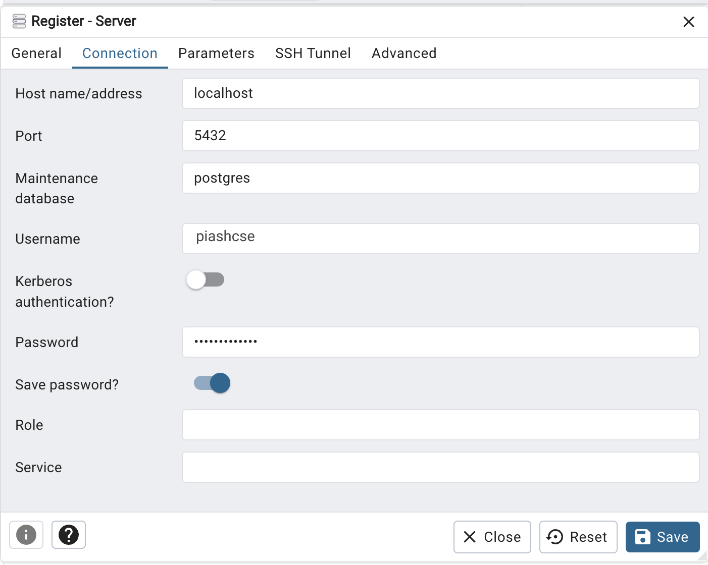

# Ktor-E-Commerce

[](https://github.com/ktorio/ktor)
[](https://github.com/JetBrains/Exposed)
[](https://kotlinlang.org)

[](https://www.postgresql.org/)
[](https://www.apache.org/licenses/LICENSE-2.0)
<a href="https://github.com/piashcse"></a>

Ktor-E-Commerce is a high-performance backend solution designed for modern e-commerce applications built
with [ktor](https://ktor.io/docs/welcome.html). This backend leverages the power of Kotlin to provide a robust,
scalable, and efficient service for handling your e-commerce needs. For detailed documentation and guides, visit the project [documentation](https://piashcse.github.io/ktor-E-Commerce).

<p align="center">
  
</p>

# Features

### 1. Role-Based Access Control

- **Customer Role**: Shoppers with basic access to browse and make purchases.
- **Seller Role**: Vendors can list products and manage their inventory.
- **Admin Role**: Administrators have full control over the platform.

### 2. User Accounts and Authentication

- **User Registration**: Allow customers to create accounts. Users can register with the same email for different roles (customer and seller).
- **User Authentication**: Implement JWT-based authentication for user sessions.
- **User Profiles**: Enable users to view and update their profiles.

### 3. Product Management

- **Product Listings**: Create, update, and delete product listings.
- **Categories**: Organize products into categories and brands for easy navigation.
- **Inventory Control**: Keep track of product availability and stock levels.

### 4. Shopping Cart and Checkout

- **Shopping Cart**: Add and remove products, update quantities, and calculate totals.
- **Checkout Summary**: Retrieve detailed checkout summary with subtotal, shipping, tax, and discount breakdown.
- **Checkout**: Streamline the checkout process with consolidated shipping address and method selection.
- **Stock Validation**: Automatic stock validation during checkout using effective inventory levels.
- **Price Validation**: Order totals validated against database prices to prevent tampering.
- **Cart Clearing**: Automatic cart clearing after successful order placement.

### 5. Order Management

- **Order Processing**: Handle order creation, status updates, and order history.
- **Order Status History**: Comprehensive audit trail for every status transition (Placed, Confirmed, Shipped, etc.).
- **Automatic Taxation**: Configurable tax calculation (default 5%) applied automatically during checkout.
- **Order Cancellation**: Customers can cancel PENDING/CONFIRMED orders with automatic stock restoration.
- **Seller Orders**: Sellers can view and manage orders from their shop.
- **Admin Orders**: Admins can view all orders with advanced filters (status, date range).
- **Human-Readable Order Numbers**: Sequential order numbers in format ORD-YYYYMMDD-XXXX.
- **Idempotency Support**: Prevent duplicate orders with idempotency keys.
- **Payment Integration**: Integrate with popular payment gateways for seamless transactions.
- **Payment Validation**: Payment amounts validated against order totals.
- **Payment History**: Track all payments for each order.

### 6. Discount & Coupon System

- **Promo Codes**: Create and manage fixed or percentage-based discount coupons.
- **Usage Limits**: Enforce expiration dates, usage limits per coupon, and minimum order amounts.
- **Admin Controls**: Dedicated administrative interface for managing the coupon lifecycle.

### 7. Refund Management

- **Refund Requests**: Customers can request refunds for order items with reasons and evidence images.
- **Refund Approval**: Sellers and admins can approve, reject, or process refunds.
- **Return Shipping**: Customers can mark approved refunds as shipped with tracking numbers.
- **Refund Tracking**: Complete refund lifecycle tracking from request to resolution.

### 6. Scalability and Performance

- **Asynchronous Processing**: Leverage Ktor's async capabilities for high performance.
- **Load Balancing**: Easily scale your application to accommodate increased traffic.

### 7. Security

- **JWT Tokens**: Implement JSON Web Tokens for secure authentication.
- **Refresh Tokens**: Secure token refresh with hashed storage and automatic revocation.
- **Rate Limiting**: Auth endpoints protected against brute-force attacks (5 req/10min).
- **Account Lockout**: Automatic 30-minute lockout after 5 failed login attempts.
- **Password Strength**: Enforced password complexity requirements (min 8 chars, mixed case, digit, special char).
- **Input Validation**: Protect against common web vulnerabilities like SQL injection and cross-site scripting (XSS).
- **Atomic Stock Operations**: Thread-safe inventory updates within database transactions.

## Architecture

<p align="center">
  </br>
  
</p>
<p align="center">
<b>Fig. Clean Architecture </b>
</p>

## Built With 🛠

- [Ktor](https://ktor.io/docs/welcome.html) - Ktor is a framework to easily build connected applications – web
  applications, HTTP services, mobile and browser applications. Modern connected applications need to be asynchronous to
  provide the best experience to users, and Kotlin Coroutines provides awesome facilities to do it in an easy and
  straightforward way.
- [Exposed](https://github.com/JetBrains/Exposed) - Exposed is a lightweight SQL library on top of JDBC driver for
  Kotlin language. Exposed has two flavors of database access: typesafe SQL wrapping DSL and lightweight Data Access
  Objects (DAO).
- [PostgreSQL](https://www.postgresql.org/) - PostgreSQL is a powerful, open-source object-relational database system
  that uses and extends the SQL language combined with many features that safely store and scale the most complicated
  data workloads.
- [Koin](https://github.com/InsertKoinIO/koin) - A pragmatic lightweight dependency injection framework for Kotlin &
  Kotlin Multiplatform.
- [Kotlinx-datetime](https://github.com/Kotlin/kotlinx-datetime) - A multiplatform Kotlin library for working with date
  and time.
- [Bcrypt](https://github.com/patrickfav/bcrypt) - A Java standalone implementation of the bcrypt password hash
  function. Based on the Blowfish cipher it is the default password hash algorithm for OpenBSD and other systems
  including some Linux distributions.
- [Apache Commons Email](https://github.com/apache/commons-email) - Apache Commons Email aims to provide an API for
  sending email. It is built on top of the JavaMail API, which it aims to simplify.
- [Ktor OpenAPI/Swagger](https://ktor.io/docs/server-openapi.html) - Ktor's built-in OpenAPI generation and Swagger UI.
- [Valiktor](https://github.com/valiktor/valiktor) - Valiktor is a type-safe, powerful and extensible fluent DSL to
  validate objects in Kotlin.

## Requirements

- [JAVA 11](https://jdk.java.net/11/) (or latest)
- [PostgreSQL](https://www.postgresql.org/) (latest)

## Clone the repository

```bash
git clone git@github.com:piashcse/ktor-E-Commerce.git
```

Note: some installation instructions are for mac, for windows/linux please install accordingly.

## Environment Configuration

This project uses DotEnv for configuration management. Follow these steps to set up your environment:

1. Create a `.env` file in the project root directory:
   ```bash
   touch .env
   ```

2. Add the following variables to your `.env` file:

   ```env
   # Database Configuration
   DB_HOST=localhost
   DB_PORT=5432
   DB_NAME=ktor-ecommerce
   DB_USER=postgres
   DB_PASSWORD=p123

   # Server Configuration
   PORT=8080
   HOST=localhost

   # JWT Configuration
   JWT_SECRET=your-super-secret-jwt-secret-key-change-in-production
   JWT_ISSUER=ktor-ecommerce-app
   JWT_AUDIENCE=ktor-ecommerce
   JWT_REALM=ktor-ecommerce

   # Email Configuration
   EMAIL_HOST=smtp.gmail.com
   EMAIL_PORT=587
   EMAIL_USERNAME=your-email@gmail.com
   EMAIL_PASSWORD=your-gmail-app-password
   ```

3. Update the values as needed for your environment, especially:
   - Database credentials to match your PostgreSQL setup
   - JWT secret with a strong, unique value for production
   - Email credentials with your actual Gmail and app password

The `.env` file is included in `.gitignore` to prevent sensitive information from being committed to the repository.

> **Note**: For email configuration, make sure to use a Gmail app password rather than your regular Gmail password. You can generate an app password in your Google Account settings under Security > 2-Step Verification > App passwords.

## PgAdmin Setup

On Terminal

```
brew install --cask pgadmin4
```

Open PgAdmin

In the "Create - Server" dialog that appears, fill in the following information:

General tab:

- Name: Give your server a name (e.g., "Ktor Ecommerce App")

Connection tab:

- Host name/address: localhost (if your PostgreSQL server is on the same machine)
- Port: 5432 (default PostgreSQL port)
- Maintenance database: postgres (default database)
- Username: piashcse (the user you created for your application)
- Password: p123 (the password you set for piashcse)




## 📧 SMTP Email Setup

This project uses Gmail’s SMTP service to send emails (e.g., for password recovery). The email configuration is managed through environment variables in your `.env` file.

### 🔧 SMTP Configuration
Configure your email settings in the `.env` file:

- `EMAIL_HOST`: SMTP server host (e.g., `smtp.gmail.com`)
- `EMAIL_PORT`: SMTP server port (e.g., `587` for TLS)
- `EMAIL_USERNAME`: Your email address
- `EMAIL_PASSWORD`: Your email app password

> **Important**: Use Gmail app passwords instead of your regular Gmail password. Generate an app password in your Google Account settings under Security > 2-Step Verification > App passwords.

## API Documentation & OpenAPI Specification

The application includes built-in API documentation and OpenAPI specification generation:

### Accessing API Documentation

- **Swagger UI**: Access interactive API documentation at the root `/` or `/swagger` endpoint when the application is running. The root URL automatically redirects to Swagger for easy API discovery.
- **Raw OpenAPI Specification**: Get the OpenAPI JSON specification at `/openapi` endpoint.

### Generating OpenAPI Specification

The static OpenAPI specification file is located at `src/main/resources/openapi/openapi.json` and includes documentation for all the main API endpoints.

To generate an updated OpenAPI specification file based on the current code:

```bash
./gradlew transformOpenApiJson
```

This will generate an updated OpenAPI specification and save it to `src/main/resources/openapi/openapi.json`.

**Note**: The OpenAPI generation feature is experimental in Ktor 3.x. The static specification file in resources provides stable documentation for all endpoints.

## Run the project

On Terminal

```
./gradlew run
```

## API Response Format

This API follows industry-standard patterns (Stripe, GitHub, OpenAI) for clean, predictable responses.

### Success Responses

- **HTTP status code indicates success** (200, 201, 204)
- **Response body contains data directly** - no wrapper objects
- No `isSuccess` or `statusCode` fields needed

**Example (200 OK):**
```json
{
  "id": "ce563774-d3d5-442e-ad1a-b884bb0a53f0",
  "email": "customer@gmail.com",
  "userType": "customer"
}
```

### Error Responses

**Standard Error (400/401/403/404/500):**
```json
{
  "message": "Invalid email or password"
}
```

**Validation Error (400):**
```json
{
  "message": "Validation failed",
  "errors": [
    {"field": "email", "message": "Invalid email format"},
    {"field": "password", "message": "Password must be at least 8 characters with uppercase, lowercase, digit, and special character"}
  ]
}
```

### Pagination

All collection-based endpoints support standardized pagination using `limit` and `offset` query parameters.

- **`limit`**: Maximum number of items to return (default: 20)
- **`offset`**: Number of items to skip (default: 0)

**Paginated Response Format:**
```json
{
  "data": [
    { ... item 1 ... },
    { ... item 2 ... }
  ],
  "metadata": {
    "totalCount": 100,
    "limit": 20,
    "skip": 0
  }
}
```

### Common Error Codes

| Status Code | Description | Example Message |
|-------------|-------------|-----------------|
| `400` | Bad Request | `"Invalid email address"` |
| `401` | Unauthorized | `"Authentication required"` |
| `403` | Forbidden | `"Insufficient permissions"` |
| `404` | Not Found | `"Product not found"` |
| `409` | Conflict | `"User already exists with this email"` |
| `410` | Gone | `"API version v0 for 'product' is no longer available"` |
| `500` | Internal Server Error | `"Internal server error"` |

### Message Constants

All error messages are centralized in `Message.kt` for consistency and maintainability:
- **Validation**: Field-level validation messages
- **Auth**: Authentication and authorization errors  
- **Orders/Products/Shops**: Domain-specific errors
- **General**: Common error messages

This ensures consistent, actionable error messages across all endpoints.

## Documentation

### 📖 MkDocs Documentation

Comprehensive API documentation is maintained using [MkDocs](https://www.mkdocs.org/) and available in the `docs/` directory. To view the documentation locally:

1. Install MkDocs: `pip install mkdocs-material`
2. Run the documentation server: `mkdocs serve`
3. Open [http://localhost:8000](http://localhost:8000) in your browser

### 🔗 API Endpoints

The API is organized into the following modules:

- **Authentication** - Login, register, OTP, password reset
- **Profile** - User profile management
- **Shop** - Shop management for sellers
- **Product** - Product catalog management
- **Cart** - Shopping cart operations and summary
- **Order** - Order processing, cancellation, and management
- **Payment** - Payment processing and history
- **Refund Request** - Refund lifecycle management
- **Inventory** - Stock management
- **Wishlist** - Product wishlist
- **Shipping** - Shipping management
- **Review & Rating** - Product reviews
- **Brand** - Brand management
- **Product Category** - Product categories
- **Shop Category** - Shop categories
- **Privacy Policy** - Policy management
- **Policy Consent** - User consent tracking

### 🌐 Swagger/OpenAPI

Interactive API documentation is available via Swagger UI at `http://localhost:8080/swagger` when the application is running.

### ROLE MANAGEMENT

<details>
<summary>Admin, Seller, Customer </summary>

- <b>Customer Role:</b> Basic shoppers who can browse products, manage their cart, wishlist, shipping addresses, and place orders.
- <b>Seller Role:</b> Vendors who can manage their own shops, list products, handle inventory, and manage orders and refund requests for their products.
- <b>Admin Role:</b> Platform administrators with full access to manage all users, shops, categories, brands, coupons, shipping methods, and system-wide settings.

</details>

### AUTH

<details>
<summary> <code>POST</code> <code>/api/v1/auth/login</code></summary>

### Description
Authenticate user with email, password and user type.
> **Security**: Rate-limited to 5 requests per 10 minutes.

### Curl
```bash
curl -X 'POST' \
  'http://localhost:8080/api/v1/auth/login' \
  -H 'accept: application/json' \
  -H 'Content-Type: application/json' \
  -d '{
  "email": "customer@gmail.com",
  "password": "p123",
  "userType": "customer"
}'
```

### Request URL
```text
http://localhost:8080/api/v1/auth/login
```

### Response
```json
{
  "data": {
    "user": {
      "id": "ce563774-d3d5-442e-ad1a-b884bb0a53f0",
      "email": "customer@gmail.com",
      "isVerified": true,
      "userType": "CUSTOMER",
      "isActive": true,
      "createdAt": "2024-05-06T12:00:00",
      "updatedAt": "2024-05-06T12:00:00"
    },
    "accessToken": "eyJhbGciOiJIUzI1NiIsInR5cCI6IkpXVCJ9...",
    "refreshToken": "764b8a1c-9d6e-4c7b-8e1f-4a3b2c1d0e9f",
    "expiresIn": 86400,
    "tokenType": "Bearer"
  },
  "message": "Login successful"
}
```
</details>

<details>
<summary> <code>POST</code> <code>/api/v1/auth/register</code></summary>

### Description
Register a new user account.

### Curl
```bash
curl -X 'POST' \
  'http://localhost:8080/api/v1/auth/register' \
  -H 'accept: application/json' \
  -H 'Content-Type: application/json' \
  -d '{
  "email": "customer@gmail.com",
  "password": "p123",
  "userType": "customer"
}'
```

### Request URL
```text
http://localhost:8080/api/v1/auth/register
```

### Response
```json
{
  "data": {
    "id": "ce563774-d3d5-442e-ad1a-b884bb0a53f0",
    "email": "customer@gmail.com",
    "message": "OTP sent to your email"
  },
  "message": "User registered successfully"
}
```
</details>

<details>
<summary> <code>GET</code> <code>/api/v1/auth/otp-verification</code></summary>

### Description
Verify user account or password reset with OTP.

### Curl
```bash
curl -X 'GET' \
  'http://localhost:8080/api/v1/auth/otp-verification?userId=ce563774-d3d5-442e-ad1a-b884bb0a53f0&otp=123456' \
  -H 'accept: application/json'
```

### Request URL
```text
http://localhost:8080/api/v1/auth/otp-verification?userId={userId}&otp={otp}
```

### Response
```json
{
  "data": true,
  "message": "OTP verified successfully"
}
```
</details>

<details>
<summary> <code>POST</code> <code>/api/v1/auth/forget-password</code></summary>

### Description
Request password reset OTP.

### Curl
```bash
curl -X 'POST' \
  'http://localhost:8080/api/v1/auth/forget-password' \
  -H 'accept: application/json' \
  -H 'Content-Type: application/json' \
  -d '{
  "email": "customer@gmail.com",
  "userType": "customer"
}'
```

### Request URL
```text
http://localhost:8080/api/v1/auth/forget-password
```

### Response
```json
{
  "data": null,
  "message": "OTP sent to your email"
}
```
</details>

<details>
<summary> <code>POST</code> <code>/api/v1/auth/reset-password</code></summary>

### Description
Reset password using OTP verification.

### Curl
```bash
curl -X 'POST' \
  'http://localhost:8080/api/v1/auth/reset-password' \
  -H 'accept: application/json' \
  -H 'Content-Type: application/json' \
  -d '{
  "email": "customer@gmail.com",
  "userType": "customer",
  "verificationCode": "123456",
  "newPassword": "newPassword123!"
}'
```

### Request URL
```text
http://localhost:8080/api/v1/auth/reset-password
```

### Response
```json
{
  "data": null,
  "message": "Password changed successfully"
}
```
</details>

<details>
<summary> <code>POST</code> <code>/api/v1/auth/refresh-token</code></summary>

### Description
Refresh access token using refresh token.

### Curl
```bash
curl -X 'POST' \
  'http://localhost:8080/api/v1/auth/refresh-token' \
  -H 'accept: application/json' \
  -H 'Content-Type: application/json' \
  -d '{
  "refreshToken": "764b8a1c-9d6e-4c7b-8e1f-4a3b2c1d0e9f"
}'
```

### Request URL
```text
http://localhost:8080/api/v1/auth/refresh-token
```

### Response
```json
{
  "data": {
    "accessToken": "eyJhbGciOiJIUzI1NiIsInR5cCI6IkpXVCJ9...",
    "refreshToken": "8f2a3b4c-5d6e-7f8a-9b0c-1d2e3f4a5b6c",
    "expiresIn": 86400
  },
  "message": "Token refreshed successfully"
}
```
</details>

<details>
<summary> <code>POST</code> <code>/api/v1/auth/logout</code></summary>

### Description
Logout authenticated user and revoke refresh token.

### Curl
```bash
curl -X 'POST' \
  'http://localhost:8080/api/v1/auth/logout' \
  -H 'accept: application/json' \
  -H 'Authorization: Bearer <token>' \
  -H 'Content-Type: application/json' \
  -d '{
  "refreshToken": "764b8a1c-9d6e-4c7b-8e1f-4a3b2c1d0e9f"
}'
```

### Request URL
```text
http://localhost:8080/api/v1/auth/logout
```

### Response
```json
{
  "data": null,
  "message": "Logged out successfully"
}
```
</details>

<details>
<summary> <code>PUT</code> <code>/api/v1/auth/change-password</code></summary>

### Description
Change password for authenticated user.

### Curl
```bash
curl -X 'PUT' \
  'http://localhost:8080/api/v1/auth/change-password?oldPassword=p123&newPassword=newPassword123!' \
  -H 'accept: application/json' \
  -H 'Authorization: Bearer <token>'
```

### Request URL
```text
http://localhost:8080/api/v1/auth/change-password?oldPassword={oldPassword}&newPassword={newPassword}
```

### Response
```json
{
  "data": null,
  "message": "Password changed successfully"
}
```
</details>

<details>
<summary> <code>PUT</code> <code>/api/v1/admin/auth/{userId}/change-user-type</code></summary>

### Description
Admin: Change user role (CUSTOMER, SELLER, ADMIN).

### Curl
```bash
curl -X 'PUT' \
  'http://localhost:8080/api/v1/admin/auth/ce563774-d3d5-442e-ad1a-b884bb0a53f0/change-user-type?userType=seller' \
  -H 'accept: application/json' \
  -H 'Authorization: Bearer <admin-token>'
```

### Request URL
```text
http://localhost:8080/api/v1/admin/auth/{userId}/change-user-type?userType={userType}
```

### Response
```json
{
  "data": null,
  "message": "User type updated successfully"
}
```
</details>

<details>
<summary> <code>PUT</code> <code>/api/v1/admin/auth/{userId}/deactivate</code></summary>

### Description
Admin: Deactivate a user account.

### Curl
```bash
curl -X 'PUT' \
  'http://localhost:8080/api/v1/admin/auth/ce563774-d3d5-442e-ad1a-b884bb0a53f0/deactivate' \
  -H 'accept: application/json' \
  -H 'Authorization: Bearer <admin-token>'
```

### Request URL
```text
http://localhost:8080/api/v1/admin/auth/{userId}/deactivate
```

### Response
```json
{
  "data": null,
  "message": "User deactivated successfully"
}
```
</details>

<details>
<summary> <code>PUT</code> <code>/api/v1/admin/auth/{userId}/activate</code></summary>

### Description
Admin: Activate a user account.

### Curl
```bash
curl -X 'PUT' \
  'http://localhost:8080/api/v1/admin/auth/ce563774-d3d5-442e-ad1a-b884bb0a53f0/activate' \
  -H 'accept: application/json' \
  -H 'Authorization: Bearer <admin-token>'
```

### Request URL
```text
http://localhost:8080/api/v1/admin/auth/{userId}/activate
```

### Response
```json
{
  "data": null,
  "message": "User activated successfully"
}
```
</details>

### PROFILE

<details>
<summary> <code>GET</code> <code>/api/v1/profile</code></summary>

### Description
Retrieve the authenticated user's profile information.

### Curl
```bash
curl -X 'GET' \
  'http://localhost:8080/api/v1/profile' \
  -H 'accept: application/json' \
  -H 'Authorization: Bearer <token>'
```

### Request URL
```text
http://localhost:8080/api/v1/profile
```

### Response
```json
{
  "data": {
    "userId": "ce563774-d3d5-442e-ad1a-b884bb0a53f0",
    "image": "http://localhost:8080/uploads/profile/profile.jpg",
    "firstName": "John",
    "lastName": "Doe",
    "mobile": "+1234567890",
    "faxNumber": null,
    "streetAddress": "123 Main St",
    "city": "New York",
    "identificationType": "Passport",
    "identificationNo": "AB123456",
    "occupation": "Developer",
    "postCode": "10001",
    "gender": "Male"
  },
  "message": "Profile retrieved successfully"
}
```
</details>

<details>
<summary> <code>PUT</code> <code>/api/v1/profile</code></summary>

### Description
Update the authenticated user's profile information.

### Curl
```bash
curl -X 'PUT' \
  'http://localhost:8080/api/v1/profile?firstName=John&lastName=Doe&mobile=%2B1234567890' \
  -H 'accept: application/json' \
  -H 'Authorization: Bearer <token>'
```

### Request URL
```text
http://localhost:8080/api/v1/profile?firstName={firstName}&lastName={lastName}&mobile={mobile}...
```

### Response
```json
{
  "data": {
    "userId": "ce563774-d3d5-442e-ad1a-b884bb0a53f0",
    "image": "http://localhost:8080/uploads/profile/profile.jpg",
    "firstName": "John",
    "lastName": "Doe",
    "mobile": "+1234567890",
    "faxNumber": null,
    "streetAddress": "123 Main St",
    "city": "New York",
    "identificationType": "Passport",
    "identificationNo": "AB123456",
    "occupation": "Developer",
    "postCode": "10001",
    "gender": "Male"
  },
  "message": "Profile updated successfully"
}
```
</details>

<details>
<summary> <code>POST</code> <code>/api/v1/profile/image-upload</code></summary>

### Description
Upload a profile image.

### Curl
```bash
curl -X 'POST' \
  'http://localhost:8080/api/v1/profile/image-upload' \
  -H 'accept: application/json' \
  -H 'Authorization: Bearer <token>' \
  -H 'Content-Type: multipart/form-data' \
  -F 'image=@/path/to/image.jpg'
```

### Request URL
```text
http://localhost:8080/api/v1/profile/image-upload
```

### Response
```json
{
  "data": "http://localhost:8080/uploads/profile/profile_uuid.jpg",
  "message": "Image uploaded successfully"
}
```
</details>

### SHOP CATEGORY

<details>
<summary> <code>POST</code> <code>/api/v1/admin/shop-category</code></summary>

### Description
Admin: Create a new shop category.

### Curl
```bash
curl -X 'POST' \
  'http://localhost:8080/api/v1/admin/shop-category' \
  -H 'accept: application/json' \
  -H 'Authorization: Bearer <admin-token>' \
  -H 'Content-Type: application/json' \
  -d '{
  "name": "Electronics"
}'
```

### Request URL
```text
http://localhost:8080/api/v1/admin/shop-category
```

### Response
```json
{
  "data": {
    "id": "ce563774-d3d5-442e-ad1a-b884bb0a53f0",
    "name": "Electronics"
  },
  "message": "Shop category created successfully"
}
```
</details>

<details>
<summary> <code>PUT</code> <code>/api/v1/admin/shop-category/{id}</code></summary>

### Description
Admin: Update an existing shop category name.

### Curl
```bash
curl -X 'PUT' \
  'http://localhost:8080/api/v1/admin/shop-category/ce563774-d3d5-442e-ad1a-b884bb0a53f0?name=Mobile%20Phones' \
  -H 'accept: application/json' \
  -H 'Authorization: Bearer <admin-token>'
```

### Request URL
```text
http://localhost:8080/api/v1/admin/shop-category/{id}?name={name}
```

### Response
```json
{
  "data": {
    "id": "ce563774-d3d5-442e-ad1a-b884bb0a53f0",
    "name": "Mobile Phones"
  },
  "message": "Shop category updated successfully"
}
```
</details>

<details>
<summary> <code>DELETE</code> <code>/api/v1/admin/shop-category/{id}</code></summary>

### Description
Admin: Permanently delete a shop category.

### Curl
```bash
curl -X 'DELETE' \
  'http://localhost:8080/api/v1/admin/shop-category/ce563774-d3d5-442e-ad1a-b884bb0a53f0' \
  -H 'accept: application/json' \
  -H 'Authorization: Bearer <admin-token>'
```

### Request URL
```text
http://localhost:8080/api/v1/admin/shop-category/{id}
```

### Response
```json
{
  "data": true,
  "message": "Shop category deleted successfully"
}
```
</details>

### SHOP

<details>
<summary> <code>GET</code> <code>/api/v1/shop/{id}</code></summary>

### Description
Retrieve detailed information about a specific shop.

### Curl
```bash
curl -X 'GET' \
  'http://localhost:8080/api/v1/shop/ce563774-d3d5-442e-ad1a-b884bb0a53f0' \
  -H 'accept: application/json'
```

### Request URL
```text
http://localhost:8080/api/v1/shop/{id}
```

### Response
```json
{
  "data": {
    "id": "ce563774-d3d5-442e-ad1a-b884bb0a53f0",
    "userId": "user-uuid",
    "shopName": "Tech Hub",
    "shopDescription": "Best electronics shop",
    "shopImage": "http://localhost:8080/uploads/shop/shop.jpg",
    "shopCategory": {
      "id": "cat-uuid",
      "name": "Electronics"
    },
    "status": "ACTIVE"
  },
  "message": "Shop details retrieved"
}
```
</details>

<details>
<summary> <code>GET</code> <code>/api/v1/shop/public</code></summary>

### Description
Retrieve public shops with filters (status, category).

### Curl
```bash
curl -X 'GET' \
  'http://localhost:8080/api/v1/shop/public?status=ACTIVE&limit=10' \
  -H 'accept: application/json'
```

### Request URL
```text
http://localhost:8080/api/v1/shop/public?status={status}&category={category}&limit={limit}&offset={offset}
```

### Response
```json
{
  "data": {
    "data": [
      {
        "id": "ce563774-d3d5-442e-ad1a-b884bb0a53f0",
        "shopName": "Tech Hub",
        "status": "ACTIVE"
      }
    ],
    "metadata": {
      "totalCount": 1,
      "limit": 10,
      "skip": 0
    }
  },
  "message": "Shops retrieved successfully"
}
```
</details>

<details>
<summary> <code>GET</code> <code>/api/v1/shop/category/{categoryId}</code></summary>

### Description
Retrieve shops by category.

### Curl
```bash
curl -X 'GET' \
  'http://localhost:8080/api/v1/shop/category/ce563774-d3d5-442e-ad1a-b884bb0a53f0' \
  -H 'accept: application/json'
```

### Request URL
```text
http://localhost:8080/api/v1/shop/category/{categoryId}?limit={limit}&offset={offset}
```

### Response
```json
{
  "data": {
    "data": [
      {
        "id": "ce563774-d3d5-442e-ad1a-b884bb0a53f0",
        "shopName": "Tech Hub"
      }
    ],
    "metadata": {
      "totalCount": 1,
      "limit": 20,
      "skip": 0
    }
  },
  "message": "Shops retrieved successfully"
}
```
</details>

<details>
<summary> <code>GET</code> <code>/api/v1/shop/featured</code></summary>

### Description
Retrieve featured shops.

### Curl
```bash
curl -X 'GET' \
  'http://localhost:8080/api/v1/shop/featured' \
  -H 'accept: application/json'
```

### Request URL
```text
http://localhost:8080/api/v1/shop/featured?limit={limit}&offset={offset}
```

### Response
```json
{
  "data": {
    "data": [
      {
        "id": "ce563774-d3d5-442e-ad1a-b884bb0a53f0",
        "shopName": "Featured Shop"
      }
    ],
    "metadata": {
      "totalCount": 5,
      "limit": 20,
      "skip": 0
    }
  },
  "message": "Featured shops retrieved"
}
```
</details>

<details>
<summary> <code>POST</code> <code>/api/v1/seller/shop</code></summary>

### Description
Seller: Create a new shop.

### Curl
```bash
curl -X 'POST' \
  'http://localhost:8080/api/v1/seller/shop' \
  -H 'accept: application/json' \
  -H 'Authorization: Bearer <seller-token>' \
  -H 'Content-Type: application/json' \
  -d '{
  "shopName": "My New Shop",
  "shopDescription": "Selling amazing gadgets",
  "categoryId": "ce563774-d3d5-442e-ad1a-b884bb0a53f0"
}'
```

### Request URL
```text
http://localhost:8080/api/v1/seller/shop
```

### Response
```json
{
  "data": {
    "id": "ce563774-d3d5-442e-ad1a-b884bb0a53f0",
    "shopName": "My New Shop",
    "status": "PENDING"
  },
  "message": "Shop created successfully and pending approval"
}
```
</details>

<details>
<summary> <code>GET</code> <code>/api/v1/seller/shop</code></summary>

### Description
Seller: Retrieve owned shops.

### Curl
```bash
curl -X 'GET' \
  'http://localhost:8080/api/v1/seller/shop' \
  -H 'accept: application/json' \
  -H 'Authorization: Bearer <seller-token>'
```

### Request URL
```text
http://localhost:8080/api/v1/seller/shop?limit={limit}&offset={offset}
```

### Response
```json
{
  "data": {
    "data": [
      {
        "id": "ce563774-d3d5-442e-ad1a-b884bb0a53f0",
        "shopName": "My New Shop"
      }
    ],
    "metadata": {
      "totalCount": 1,
      "limit": 20,
      "skip": 0
    }
  },
  "message": "Shops retrieved"
}
```
</details>

<details>
<summary> <code>PUT</code> <code>/api/v1/seller/shop/{id}</code></summary>

### Description
Seller: Update shop details.

### Curl
```bash
curl -X 'PUT' \
  'http://localhost:8080/api/v1/seller/shop/ce563774-d3d5-442e-ad1a-b884bb0a53f0' \
  -H 'accept: application/json' \
  -H 'Authorization: Bearer <seller-token>' \
  -H 'Content-Type: application/json' \
  -d '{
  "shopName": "Updated Shop Name",
  "shopDescription": "New description"
}'
```

### Request URL
```text
http://localhost:8080/api/v1/seller/shop/{id}
```

### Response
```json
{
  "data": {
    "id": "ce563774-d3d5-442e-ad1a-b884bb0a53f0",
    "shopName": "Updated Shop Name"
  },
  "message": "Shop updated successfully"
}
```
</details>

<details>
<summary> <code>PUT</code> <code>/api/v2/seller/shop/{shopId}</code></summary>

### Description
Seller: Update shop details with optimized response.

### Curl
```bash
curl -X 'PUT' \
  'http://localhost:8080/api/v2/seller/shop/ce563774-d3d5-442e-ad1a-b884bb0a53f0?source=mobile' \
  -H 'accept: application/json' \
  -H 'Authorization: Bearer <seller-token>' \
  -H 'Content-Type: application/json' \
  -d '{
  "shopName": "V2 Updated Name"
}'
```

### Request URL
```text
http://localhost:8080/api/v2/seller/shop/{shopId}?source={source}
```

### Response
```json
{
  "data": {
    "v2_data": {
      "id": "ce563774-d3d5-442e-ad1a-b884bb0a53f0",
      "shopName": "V2 Updated Name"
    },
    "source": "mobile"
  },
  "message": "Shop updated (V2)"
}
```
</details>

<details>
<summary> <code>GET</code> <code>/api/v1/admin/shop/status</code></summary>

### Description
Admin: Retrieve shops filtered by status.

### Curl
```bash
curl -X 'GET' \
  'http://localhost:8080/api/v1/admin/shop/status?status=PENDING' \
  -H 'accept: application/json' \
  -H 'Authorization: Bearer <admin-token>'
```

### Request URL
```text
http://localhost:8080/api/v1/admin/shop/status?status={status}&limit={limit}&offset={offset}
```

### Response
```json
{
  "data": {
    "data": [
      {
        "id": "ce563774-d3d5-442e-ad1a-b884bb0a53f0",
        "shopName": "Pending Shop"
      }
    ],
    "metadata": {
      "totalCount": 3,
      "limit": 20,
      "skip": 0
    }
  },
  "message": "Shops retrieved"
}
```
</details>

<details>
<summary> <code>PUT</code> <code>/api/v1/admin/shop/approve/{id}</code></summary>

### Description
Admin: Approve a pending shop application.

### Curl
```bash
curl -X 'PUT' \
  'http://localhost:8080/api/v1/admin/shop/approve/ce563774-d3d5-442e-ad1a-b884bb0a53f0' \
  -H 'accept: application/json' \
  -H 'Authorization: Bearer <admin-token>'
```

### Request URL
```text
http://localhost:8080/api/v1/admin/shop/approve/{id}
```

### Response
```json
{
  "data": true,
  "message": "Shop approved successfully"
}
```
</details>

<details>
<summary> <code>PUT</code> <code>/api/v1/admin/shop/reject/{id}</code></summary>

### Description
Admin: Reject a shop application.

### Curl
```bash
curl -X 'PUT' \
  'http://localhost:8080/api/v1/admin/shop/reject/ce563774-d3d5-442e-ad1a-b884bb0a53f0' \
  -H 'accept: application/json' \
  -H 'Authorization: Bearer <admin-token>'
```

### Request URL
```text
http://localhost:8080/api/v1/admin/shop/reject/{id}
```

### Response
```json
{
  "data": true,
  "message": "Shop application rejected"
}
```
</details>

<details>
<summary> <code>PUT</code> <code>/api/v1/admin/shop/suspend/{id}</code></summary>

### Description
Admin: Suspend an active shop.

### Curl
```bash
curl -X 'PUT' \
  'http://localhost:8080/api/v1/admin/shop/suspend/ce563774-d3d5-442e-ad1a-b884bb0a53f0' \
  -H 'accept: application/json' \
  -H 'Authorization: Bearer <admin-token>'
```

### Request URL
```text
http://localhost:8080/api/v1/admin/shop/suspend/{id}
```

### Response
```json
{
  "data": true,
  "message": "Shop suspended"
}
```
</details>

<details>
<summary> <code>PUT</code> <code>/api/v1/admin/shop/activate/{id}</code></summary>

### Description
Admin: Activate a suspended shop.

### Curl
```bash
curl -X 'PUT' \
  'http://localhost:8080/api/v1/admin/shop/activate/ce563774-d3d5-442e-ad1a-b884bb0a53f0' \
  -H 'accept: application/json' \
  -H 'Authorization: Bearer <admin-token>'
```

### Request URL
```text
http://localhost:8080/api/v1/admin/shop/activate/{id}
```

### Response
```json
{
  "data": true,
  "message": "Shop activated"
}
```
</details>

### BRAND

<details>
<summary> <code>GET</code> <code>/api/v1/brand</code></summary>

### Description
Retrieve a paginated list of all brands.

### Curl
```bash
curl -X 'GET' \
  'http://localhost:8080/api/v1/brand?limit=20&offset=0' \
  -H 'accept: application/json'
```

### Request URL
```text
http://localhost:8080/api/v1/brand?limit={limit}&offset={offset}
```

### Response
```json
{
  "data": {
    "data": [
      {
        "id": "ce563774-d3d5-442e-ad1a-b884bb0a53f0",
        "name": "Samsung"
      }
    ],
    "metadata": {
      "totalCount": 50,
      "limit": 20,
      "skip": 0
    }
  },
  "message": "Brands retrieved"
}
```
</details>

<details>
<summary> <code>POST</code> <code>/api/v1/admin/brand</code></summary>

### Description
Admin: Create a new brand.

### Curl
```bash
curl -X 'POST' \
  'http://localhost:8080/api/v1/admin/brand' \
  -H 'accept: application/json' \
  -H 'Authorization: Bearer <admin-token>' \
  -H 'Content-Type: application/json' \
  -d '{
  "name": "Apple"
}'
```

### Request URL
```text
http://localhost:8080/api/v1/admin/brand
```

### Response
```json
{
  "data": {
    "id": "ce563774-d3d5-442e-ad1a-b884bb0a53f0",
    "name": "Apple"
  },
  "message": "Brand created successfully"
}
```
</details>

<details>
<summary> <code>PUT</code> <code>/api/v1/admin/brand/{id}</code></summary>

### Description
Admin: Update an existing brand.

### Curl
```bash
curl -X 'PUT' \
  'http://localhost:8080/api/v1/admin/brand/ce563774-d3d5-442e-ad1a-b884bb0a53f0?name=Apple%20Inc' \
  -H 'accept: application/json' \
  -H 'Authorization: Bearer <admin-token>'
```

### Request URL
```text
http://localhost:8080/api/v1/admin/brand/{id}?name={name}
```

### Response
```json
{
  "data": {
    "id": "ce563774-d3d5-442e-ad1a-b884bb0a53f0",
    "name": "Apple Inc"
  },
  "message": "Brand updated successfully"
}
```
</details>

<details>
<summary> <code>DELETE</code> <code>/api/v1/admin/brand/{id}</code></summary>

### Description
Admin: Delete a brand.

### Curl
```bash
curl -X 'DELETE' \
  'http://localhost:8080/api/v1/admin/brand/ce563774-d3d5-442e-ad1a-b884bb0a53f0' \
  -H 'accept: application/json' \
  -H 'Authorization: Bearer <admin-token>'
```

### Request URL
```text
http://localhost:8080/api/v1/admin/brand/{id}
```

### Response
```json
{
  "data": true,
  "message": "Brand deleted successfully"
}
```
</details>

### PRODUCT CATEGORY

<details>
<summary> <code>GET</code> <code>/api/v1/product-category</code></summary>

### Description
Retrieve a paginated list of all product categories.

### Curl
```bash
curl -X 'GET' \
  'http://localhost:8080/api/v1/product-category?limit=20&offset=0' \
  -H 'accept: application/json'
```

### Request URL
```text
http://localhost:8080/api/v1/product-category?limit={limit}&offset={offset}
```

### Response
```json
{
  "data": {
    "data": [
      {
        "id": "ce563774-d3d5-442e-ad1a-b884bb0a53f0",
        "name": "Smartphones"
      }
    ],
    "metadata": {
      "totalCount": 15,
      "limit": 20,
      "skip": 0
    }
  },
  "message": "Categories retrieved"
}
```
</details>

<details>
<summary> <code>POST</code> <code>/api/v1/admin/product-category</code></summary>

### Description
Admin: Create a new product category.

### Curl
```bash
curl -X 'POST' \
  'http://localhost:8080/api/v1/admin/product-category?name=Laptops' \
  -H 'accept: application/json' \
  -H 'Authorization: Bearer <admin-token>'
```

### Request URL
```text
http://localhost:8080/api/v1/admin/product-category?name={name}
```

### Response
```json
{
  "data": {
    "id": "ce563774-d3d5-442e-ad1a-b884bb0a53f0",
    "name": "Laptops"
  },
  "message": "Category created successfully"
}
```
</details>

<details>
<summary> <code>PUT</code> <code>/api/v1/admin/product-category/{id}</code></summary>

### Description
Admin: Update an existing product category.

### Curl
```bash
curl -X 'PUT' \
  'http://localhost:8080/api/v1/admin/product-category/ce563774-d3d5-442e-ad1a-b884bb0a53f0?name=Gaming%20Laptops' \
  -H 'accept: application/json' \
  -H 'Authorization: Bearer <admin-token>'
```

### Request URL
```text
http://localhost:8080/api/v1/admin/product-category/{id}?name={name}
```

### Response
```json
{
  "data": {
    "id": "ce563774-d3d5-442e-ad1a-b884bb0a53f0",
    "name": "Gaming Laptops"
  },
  "message": "Category updated successfully"
}
```
</details>

<details>
<summary> <code>DELETE</code> <code>/api/v1/admin/product-category/{id}</code></summary>

### Description
Admin: Permanently delete a product category.

### Curl
```bash
curl -X 'DELETE' \
  'http://localhost:8080/api/v1/admin/product-category/ce563774-d3d5-442e-ad1a-b884bb0a53f0' \
  -H 'accept: application/json' \
  -H 'Authorization: Bearer <admin-token>'
```

### Request URL
```text
http://localhost:8080/api/v1/admin/product-category/{id}
```

### Response
```json
{
  "data": true,
  "message": "Category deleted successfully"
}
```
</details>

### PRODUCT SUB CATEGORY

<details>
<summary> <code>GET</code> <code>/api/v1/product-subcategory</code></summary>

### Description
Retrieve subcategories for a specific category (require categoryId).

### Curl
```bash
curl -X 'GET' \
  'http://localhost:8080/api/v1/product-subcategory?categoryId=ce563774-d3d5-442e-ad1a-b884bb0a53f0' \
  -H 'accept: application/json'
```

### Request URL
```text
http://localhost:8080/api/v1/product-subcategory?categoryId={categoryId}&limit={limit}&offset={offset}
```

### Response
```json
{
  "data": {
    "data": [
      {
        "id": "sub-uuid",
        "categoryId": "ce563774-d3d5-442e-ad1a-b884bb0a53f0",
        "name": "Android Phones"
      }
    ],
    "metadata": {
      "totalCount": 5,
      "limit": 20,
      "skip": 0
    }
  },
  "message": "Subcategories retrieved"
}
```
</details>

<details>
<summary> <code>POST</code> <code>/api/v1/admin/product-subcategory</code></summary>

### Description
Admin: Create a new product subcategory.

### Curl
```bash
curl -X 'POST' \
  'http://localhost:8080/api/v1/admin/product-subcategory' \
  -H 'accept: application/json' \
  -H 'Authorization: Bearer <admin-token>' \
  -H 'Content-Type: application/json' \
  -d '{
  "categoryId": "ce563774-d3d5-442e-ad1a-b884bb0a53f0",
  "name": "iPhones"
}'
```

### Request URL
```text
http://localhost:8080/api/v1/admin/product-subcategory
```

### Response
```json
{
  "data": {
    "id": "sub-uuid",
    "categoryId": "ce563774-d3d5-442e-ad1a-b884bb0a53f0",
    "name": "iPhones"
  },
  "message": "Subcategory created successfully"
}
```
</details>

<details>
<summary> <code>PUT</code> <code>/api/v1/admin/product-subcategory/{id}</code></summary>

### Description
Admin: Update an existing product subcategory name.

### Curl
```bash
curl -X 'PUT' \
  'http://localhost:8080/api/v1/admin/product-subcategory/sub-uuid?name=Apple%20iPhones' \
  -H 'accept: application/json' \
  -H 'Authorization: Bearer <admin-token>'
```

### Request URL
```text
http://localhost:8080/api/v1/admin/product-subcategory/{id}?name={name}
```

### Response
```json
{
  "data": {
    "id": "sub-uuid",
    "name": "Apple iPhones"
  },
  "message": "Subcategory updated successfully"
}
```
</details>

<details>
<summary> <code>DELETE</code> <code>/api/v1/admin/product-subcategory/{id}</code></summary>

### Description
Admin: Permanently delete a product subcategory.

### Curl
```bash
curl -X 'DELETE' \
  'http://localhost:8080/api/v1/admin/product-subcategory/sub-uuid' \
  -H 'accept: application/json' \
  -H 'Authorization: Bearer <admin-token>'
```

### Request URL
```text
http://localhost:8080/api/v1/admin/product-subcategory/{id}
```

### Response
```json
{
  "data": true,
  "message": "Subcategory deleted successfully"
}
```
</details>

### PRODUCT

<details>
<summary> <code>GET</code> <code>/api/v1/product/{id}</code></summary>

### Description
Retrieve detailed information about a specific product.

### Curl
```bash
curl -X 'GET' \
  'http://localhost:8080/api/v1/product/ce563774-d3d5-442e-ad1a-b884bb0a53f0' \
  -H 'accept: application/json'
```

### Request URL
```text
http://localhost:8080/api/v1/product/{id}
```

### Response
```json
{
  "data": {
    "id": "ce563774-d3d5-442e-ad1a-b884bb0a53f0",
    "name": "Galaxy S24",
    "productDescription": "Latest flagship phone",
    "productPrice": 999.99,
    "productStock": 50,
    "productImage": "http://localhost:8080/uploads/product/s24.jpg",
    "categoryId": "cat-uuid",
    "subCategoryId": "sub-uuid",
    "brandId": "brand-uuid"
  },
  "message": "Product details retrieved"
}
```
</details>

<details>
<summary> <code>GET</code> <code>/api/v1/product</code></summary>

### Description
Retrieve a paginated list of products with optional filters.

### Curl
```bash
curl -X 'GET' \
  'http://localhost:8080/api/v1/product?maxPrice=1000&sortBy=price&sortOrder=asc' \
  -H 'accept: application/json'
```

### Request URL
```text
http://localhost:8080/api/v1/product?maxPrice={maxPrice}&minPrice={minPrice}&categoryId={categoryId}&subCategoryId={subCategoryId}&brandId={brandId}&sortBy={sortBy}&sortOrder={sortOrder}&limit={limit}&offset={offset}
```

### Response
```json
{
  "data": {
    "data": [
      {
        "id": "ce563774-d3d5-442e-ad1a-b884bb0a53f0",
        "name": "Galaxy S24",
        "productPrice": 999.99
      }
    ],
    "metadata": {
      "totalCount": 100,
      "limit": 10,
      "skip": 0
    }
  },
  "message": "Products retrieved"
}
```
</details>

<details>
<summary> <code>GET</code> <code>/api/v1/product/search</code></summary>

### Description
Search for products by name.

### Curl
```bash
curl -X 'GET' \
  'http://localhost:8080/api/v1/product/search?name=Galaxy' \
  -H 'accept: application/json'
```

### Request URL
```text
http://localhost:8080/api/v1/product/search?name={name}&limit={limit}&offset={offset}
```

### Response
```json
{
  "data": {
    "data": [
      {
        "id": "ce563774-d3d5-442e-ad1a-b884bb0a53f0",
        "name": "Galaxy S24"
      }
    ],
    "metadata": {
      "totalCount": 10,
      "limit": 10,
      "skip": 0
    }
  },
  "message": "Search results retrieved"
}
```
</details>

<details>
<summary> <code>GET</code> <code>/api/v1/seller/product</code></summary>

### Description
Seller: Retrieve seller products with filters.

### Curl
```bash
curl -X 'GET' \
  'http://localhost:8080/api/v1/seller/product' \
  -H 'accept: application/json' \
  -H 'Authorization: Bearer <seller-token>'
```

### Request URL
```text
http://localhost:8080/api/v1/seller/product?limit={limit}&offset={offset}
```

### Response
```json
{
  "data": {
    "data": [
      {
        "id": "ce563774-d3d5-442e-ad1a-b884bb0a53f0",
        "name": "Galaxy S24"
      }
    ],
    "metadata": {
      "totalCount": 5,
      "limit": 10,
      "skip": 0
    }
  },
  "message": "Seller products retrieved"
}
```
</details>

<details>
<summary> <code>POST</code> <code>/api/v1/seller/product</code></summary>

### Description
Seller: Add a new product listing.

### Curl
```bash
curl -X 'POST' \
  'http://localhost:8080/api/v1/seller/product' \
  -H 'accept: application/json' \
  -H 'Authorization: Bearer <seller-token>' \
  -H 'Content-Type: application/json' \
  -d '{
  "name": "New Product",
  "productDescription": "Description",
  "productPrice": 199.99,
  "productStock": 100,
  "categoryId": "cat-uuid",
  "subCategoryId": "sub-uuid",
  "brandId": "brand-uuid"
}'
```

### Request URL
```text
http://localhost:8080/api/v1/seller/product
```

### Response
```json
{
  "data": {
    "id": "ce563774-d3d5-442e-ad1a-b884bb0a53f0",
    "name": "New Product"
  },
  "message": "Product created successfully"
}
```
</details>

<details>
<summary> <code>PUT</code> <code>/api/v1/seller/product/{id}</code></summary>

### Description
Seller: Update an existing product listing.

### Curl
```bash
curl -X 'PUT' \
  'http://localhost:8080/api/v1/seller/product/ce563774-d3d5-442e-ad1a-b884bb0a53f0' \
  -H 'accept: application/json' \
  -H 'Authorization: Bearer <seller-token>' \
  -H 'Content-Type: application/json' \
  -d '{
  "productPrice": 189.99
}'
```

### Request URL
```text
http://localhost:8080/api/v1/seller/product/{id}
```

### Response
```json
{
  "data": {
    "id": "ce563774-d3d5-442e-ad1a-b884bb0a53f0",
    "productPrice": 189.99
  },
  "message": "Product updated successfully"
}
```
</details>

<details>
<summary> <code>DELETE</code> <code>/api/v1/seller/product/{id}</code></summary>

### Description
Seller: Permanently delete a product listing.

### Curl
```bash
curl -X 'DELETE' \
  'http://localhost:8080/api/v1/seller/product/ce563774-d3d5-442e-ad1a-b884bb0a53f0' \
  -H 'accept: application/json' \
  -H 'Authorization: Bearer <seller-token>'
```

### Request URL
```text
http://localhost:8080/api/v1/seller/product/{id}
```

### Response
```json
{
  "data": true,
  "message": "Product deleted successfully"
}
```
</details>

<details>
<summary> <code>POST</code> <code>/api/v1/seller/product/image-upload</code></summary>

### Description
Seller: Upload a product image.

### Curl
```bash
curl -X 'POST' \
  'http://localhost:8080/api/v1/seller/product/image-upload' \
  -H 'accept: application/json' \
  -H 'Authorization: Bearer <seller-token>' \
  -H 'Content-Type: multipart/form-data' \
  -F 'image=@/path/to/product.jpg'
```

### Request URL
```text
http://localhost:8080/api/v1/seller/product/image-upload
```

### Response
```json
{
  "data": "http://localhost:8080/uploads/product/prod_uuid.jpg",
  "message": "Product image uploaded"
}
```
</details>

<details>
<summary> <code>DELETE</code> <code>/api/v1/admin/product/{id}</code></summary>

### Description
Admin: Permanently delete any product.

### Curl
```bash
curl -X 'DELETE' \
  'http://localhost:8080/api/v1/admin/product/ce563774-d3d5-442e-ad1a-b884bb0a53f0' \
  -H 'accept: application/json' \
  -H 'Authorization: Bearer <admin-token>'
```

### Request URL
```text
http://localhost:8080/api/v1/admin/product/{id}
```

### Response
```json
{
  "data": true,
  "message": "Product deleted by admin"
}
```
</details>

### REVIEW RATING

<details>
<summary> <code>GET</code> <code>/api/v1/review-rating</code></summary>

### Description
Retrieve reviews and ratings for a specific product.

### Curl
```bash
curl -X 'GET' \
  'http://localhost:8080/api/v1/review-rating?productId=ce563774-d3d5-442e-ad1a-b884bb0a53f0' \
  -H 'accept: application/json'
```

### Request URL
```text
http://localhost:8080/api/v1/review-rating?productId={productId}&limit={limit}&offset={offset}
```

### Response
```json
{
  "data": {
    "data": [
      {
        "id": "review-uuid",
        "userId": "user-uuid",
        "productId": "ce563774-d3d5-442e-ad1a-b884bb0a53f0",
        "review": "Excellent product!",
        "rating": 5,
        "createdAt": "2024-05-06T12:00:00"
      }
    ],
    "metadata": {
      "totalCount": 1,
      "limit": 20,
      "skip": 0
    }
  },
  "message": "Reviews retrieved successfully"
}
```
</details>

<details>
<summary> <code>POST</code> <code>/api/v1/review-rating</code></summary>

### Description
Submit a new review and rating for a product.

### Curl
```bash
curl -X 'POST' \
  'http://localhost:8080/api/v1/review-rating' \
  -H 'accept: application/json' \
  -H 'Authorization: Bearer <token>' \
  -H 'Content-Type: application/json' \
  -d '{
  "productId": "ce563774-d3d5-442e-ad1a-b884bb0a53f0",
  "review": "Very good product",
  "rating": 4
}'
```

### Request URL
```text
http://localhost:8080/api/v1/review-rating
```

### Response
```json
{
  "data": {
    "id": "review-uuid",
    "review": "Very good product",
    "rating": 4
  },
  "message": "Review submitted successfully"
}
```
</details>

<details>
<summary> <code>PUT</code> <code>/api/v1/review-rating/{id}</code></summary>

### Description
Update an existing review and rating.

### Curl
```bash
curl -X 'PUT' \
  'http://localhost:8080/api/v1/review-rating/review-uuid?review=Updated%20review&rating=5' \
  -H 'accept: application/json' \
  -H 'Authorization: Bearer <token>'
```

### Request URL
```text
http://localhost:8080/api/v1/review-rating/{id}?review={review}&rating={rating}
```

### Response
```json
{
  "data": {
    "id": "review-uuid",
    "review": "Updated review",
    "rating": 5
  },
  "message": "Review updated successfully"
}
```
</details>

<details>
<summary> <code>DELETE</code> <code>/api/v1/review-rating/{id}</code></summary>

### Description
Delete a review and rating.

### Curl
```bash
curl -X 'DELETE' \
  'http://localhost:8080/api/v1/review-rating/review-uuid' \
  -H 'accept: application/json' \
  -H 'Authorization: Bearer <token>'
```

### Request URL
```text
http://localhost:8080/api/v1/review-rating/{id}
```

### Response
```json
{
  "data": true,
  "message": "Review deleted successfully"
}
```
</details>

### CART

<details>
<summary> <code>POST</code> <code>/api/v1/cart</code></summary>

### Description
Add an item to the authenticated user's cart.

### Curl
```bash
curl -X 'POST' \
  'http://localhost:8080/api/v1/cart' \
  -H 'accept: application/json' \
  -H 'Authorization: Bearer <token>' \
  -H 'Content-Type: application/json' \
  -d '{
  "productId": "ce563774-d3d5-442e-ad1a-b884bb0a53f0",
  "quantity": 2
}'
```

### Request URL
```text
http://localhost:8080/api/v1/cart
```

### Response
```json
{
  "data": {
    "productId": "ce563774-d3d5-442e-ad1a-b884bb0a53f0",
    "quantity": 2
  },
  "message": "Item added to cart"
}
```
</details>

<details>
<summary> <code>GET</code> <code>/api/v1/cart</code></summary>

### Description
Retrieve all items in the authenticated user's cart.

### Curl
```bash
curl -X 'GET' \
  'http://localhost:8080/api/v1/cart' \
  -H 'accept: application/json' \
  -H 'Authorization: Bearer <token>'
```

### Request URL
```text
http://localhost:8080/api/v1/cart?limit={limit}&offset={offset}
```

### Response
```json
{
  "data": {
    "data": [
      {
        "productId": "ce563774-d3d5-442e-ad1a-b884bb0a53f0",
        "quantity": 2,
        "productName": "Galaxy S24",
        "price": 999.99
      }
    ],
    "metadata": {
      "totalCount": 1,
      "limit": 20,
      "skip": 0
    }
  },
  "message": "Cart items retrieved"
}
```
</details>

<details>
<summary> <code>PUT</code> <code>/api/v1/cart/update</code></summary>

### Description
Update the quantity of an item in the cart.

### Curl
```bash
curl -X 'PUT' \
  'http://localhost:8080/api/v1/cart/update' \
  -H 'accept: application/json' \
  -H 'Authorization: Bearer <token>' \
  -H 'Content-Type: application/json' \
  -d '{
  "productId": "ce563774-d3d5-442e-ad1a-b884bb0a53f0",
  "quantity": 5
}'
```

### Request URL
```text
http://localhost:8080/api/v1/cart/update
```

### Response
```json
{
  "data": {
    "productId": "ce563774-d3d5-442e-ad1a-b884bb0a53f0",
    "quantity": 5
  },
  "message": "Cart quantity updated"
}
```
</details>

<details>
<summary> <code>DELETE</code> <code>/api/v1/cart/remove</code></summary>

### Description
Remove a specific item from the cart (require productId).

### Curl
```bash
curl -X 'DELETE' \
  'http://localhost:8080/api/v1/cart/remove?productId=ce563774-d3d5-442e-ad1a-b884bb0a53f0' \
  -H 'accept: application/json' \
  -H 'Authorization: Bearer <token>'
```

### Request URL
```text
http://localhost:8080/api/v1/cart/remove?productId={productId}
```

### Response
```json
{
  "data": true,
  "message": "Item removed from cart"
}
```
</details>

<details>
<summary> <code>DELETE</code> <code>/api/v1/cart/all</code></summary>

### Description
Remove all items from the authenticated user's cart.

### Curl
```bash
curl -X 'DELETE' \
  'http://localhost:8080/api/v1/cart/all' \
  -H 'accept: application/json' \
  -H 'Authorization: Bearer <token>'
```

### Request URL
```text
http://localhost:8080/api/v1/cart/all
```

### Response
```json
{
  "data": true,
  "message": "Cart cleared successfully"
}
```
</details>

<details>
<summary> <code>GET</code> <code>/api/v1/cart/summary</code></summary>

### Description
Retrieve a summary of the cart (totals, counts).

### Curl
```bash
curl -X 'GET' \
  'http://localhost:8080/api/v1/cart/summary' \
  -H 'accept: application/json' \
  -H 'Authorization: Bearer <token>'
```

### Request URL
```text
http://localhost:8080/api/v1/cart/summary
```

### Response
```json
{
  "data": {
    "totalItems": 2,
    "subTotal": 1999.98,
    "shipping": 10.00,
    "tax": 99.99,
    "total": 2109.97
  },
  "message": "Cart summary retrieved"
}
```
</details>

### WISHLIST

<details>
<summary> <code>POST</code> <code>/api/v1/wishlist</code></summary>

### Description
Add a product to the authenticated user's wishlist.

### Curl
```bash
curl -X 'POST' \
  'http://localhost:8080/api/v1/wishlist' \
  -H 'accept: application/json' \
  -H 'Authorization: Bearer <token>' \
  -H 'Content-Type: application/json' \
  -d '{
  "productId": "ce563774-d3d5-442e-ad1a-b884bb0a53f0"
}'
```

### Request URL
```text
http://localhost:8080/api/v1/wishlist
```

### Response
```json
{
  "data": {
    "productId": "ce563774-d3d5-442e-ad1a-b884bb0a53f0"
  },
  "message": "Added to wishlist"
}
```
</details>

<details>
<summary> <code>GET</code> <code>/api/v1/wishlist</code></summary>

### Description
Retrieve all items in the user's wishlist.

### Curl
```bash
curl -X 'GET' \
  'http://localhost:8080/api/v1/wishlist' \
  -H 'accept: application/json' \
  -H 'Authorization: Bearer <token>'
```

### Request URL
```text
http://localhost:8080/api/v1/wishlist?limit={limit}&offset={offset}
```

### Response
```json
{
  "data": {
    "data": [
      {
        "productId": "ce563774-d3d5-442e-ad1a-b884bb0a53f0",
        "productName": "Galaxy S24",
        "price": 999.99
      }
    ],
    "metadata": {
      "totalCount": 1,
      "limit": 20,
      "skip": 0
    }
  },
  "message": "Wishlist retrieved"
}
```
</details>

<details>
<summary> <code>DELETE</code> <code>/api/v1/wishlist/remove</code></summary>

### Description
Remove a specific product from the wishlist.

### Curl
```bash
curl -X 'DELETE' \
  'http://localhost:8080/api/v1/wishlist/remove?productId=ce563774-d3d5-442e-ad1a-b884bb0a53f0' \
  -H 'accept: application/json' \
  -H 'Authorization: Bearer <token>'
```

### Request URL
```text
http://localhost:8080/api/v1/wishlist/remove?productId={productId}
```

### Response
```json
{
  "data": true,
  "message": "Removed from wishlist"
}
```
</details>

<details>
<summary> <code>GET</code> <code>/api/v1/wishlist/check</code></summary>

### Description
Check if a specific product is in the user's wishlist.

### Curl
```bash
curl -X 'GET' \
  'http://localhost:8080/api/v1/wishlist/check?productId=ce563774-d3d5-442e-ad1a-b884bb0a53f0' \
  -H 'accept: application/json' \
  -H 'Authorization: Bearer <token>'
```

### Request URL
```text
http://localhost:8080/api/v1/wishlist/check?productId={productId}
```

### Response
```json
{
  "data": true,
  "message": "Product is in wishlist"
}
```
</details>

### CHECKOUT

<details>
<summary> <code>POST</code> <code>/api/v1/checkout/shipping-address</code></summary>

### Description
Add a new shipping address for the authenticated user.

### Curl
```bash
curl -X 'POST' \
  'http://localhost:8080/api/v1/checkout/shipping-address' \
  -H 'accept: application/json' \
  -H 'Authorization: Bearer <token>' \
  -H 'Content-Type: application/json' \
  -d '{
  "addressName": "Home",
  "firstName": "John",
  "lastName": "Doe",
  "mobile": "+1234567890",
  "streetAddress": "123 Main St",
  "city": "New York",
  "postCode": "10001",
  "country": "USA"
}'
```

### Request URL
```text
http://localhost:8080/api/v1/checkout/shipping-address
```

### Response
```json
{
  "data": {
    "id": "ce563774-d3d5-442e-ad1a-b884bb0a53f0",
    "addressName": "Home",
    "city": "New York"
  },
  "message": "Shipping address added"
}
```
</details>

<details>
<summary> <code>GET</code> <code>/api/v1/checkout/shipping-address</code></summary>

### Description
Retrieve all shipping addresses for the authenticated user.

### Curl
```bash
curl -X 'GET' \
  'http://localhost:8080/api/v1/checkout/shipping-address' \
  -H 'accept: application/json' \
  -H 'Authorization: Bearer <token>'
```

### Request URL
```text
http://localhost:8080/api/v1/checkout/shipping-address
```

### Response
```json
{
  "data": [
    {
      "id": "ce563774-d3d5-442e-ad1a-b884bb0a53f0",
      "addressName": "Home",
      "streetAddress": "123 Main St"
    }
  ],
  "message": "Shipping addresses retrieved"
}
```
</details>

<details>
<summary> <code>PUT</code> <code>/api/v1/checkout/shipping-address/{id}</code></summary>

### Description
Update an existing shipping address.

### Curl
```bash
curl -X 'PUT' \
  'http://localhost:8080/api/v1/checkout/shipping-address/ce563774-d3d5-442e-ad1a-b884bb0a53f0' \
  -H 'accept: application/json' \
  -H 'Authorization: Bearer <token>' \
  -H 'Content-Type: application/json' \
  -d '{
  "addressName": "Office"
}'
```

### Request URL
```text
http://localhost:8080/api/v1/checkout/shipping-address/{id}
```

### Response
```json
{
  "data": {
    "id": "ce563774-d3d5-442e-ad1a-b884bb0a53f0",
    "addressName": "Office"
  },
  "message": "Shipping address updated"
}
```
</details>

<details>
<summary> <code>DELETE</code> <code>/api/v1/checkout/shipping-address/{id}</code></summary>

### Description
Delete a shipping address.

### Curl
```bash
curl -X 'DELETE' \
  'http://localhost:8080/api/v1/checkout/shipping-address/ce563774-d3d5-442e-ad1a-b884bb0a53f0' \
  -H 'accept: application/json' \
  -H 'Authorization: Bearer <token>'
```

### Request URL
```text
http://localhost:8080/api/v1/checkout/shipping-address/{id}
```

### Response
```json
{
  "data": true,
  "message": "Shipping address deleted"
}
```
</details>

<details>
<summary> <code>GET</code> <code>/api/v1/checkout/shipping-method</code></summary>

### Description
Retrieve all available shipping methods.

### Curl
```bash
curl -X 'GET' \
  'http://localhost:8080/api/v1/checkout/shipping-method' \
  -H 'accept: application/json' \
  -H 'Authorization: Bearer <token>'
```

### Request URL
```text
http://localhost:8080/api/v1/checkout/shipping-method
```

### Response
```json
{
  "data": [
    {
      "id": "ce563774-d3d5-442e-ad1a-b884bb0a53f0",
      "name": "Express Shipping",
      "price": 15.00
    }
  ],
  "message": "Shipping methods retrieved"
}
```
</details>

<details>
<summary> <code>POST</code> <code>/api/v1/checkout/summary</code></summary>

### Description
Get a summary of the checkout (totals) without placing an order.

### Curl
```bash
curl -X 'POST' \
  'http://localhost:8080/api/v1/checkout/summary' \
  -H 'accept: application/json' \
  -H 'Authorization: Bearer <token>' \
  -H 'Content-Type: application/json' \
  -d '{
  "shippingAddressId": "ce563774-d3d5-442e-ad1a-b884bb0a53f0",
  "shippingMethodId": "ce563774-d3d5-442e-ad1a-b884bb0a53f0",
  "couponCode": "SUMMER20"
}'
```

### Request URL
```text
http://localhost:8080/api/v1/checkout/summary
```

### Response
```json
{
  "data": {
    "subTotal": 1999.98,
    "shipping": 15.00,
    "tax": 99.99,
    "discount": 200.00,
    "total": 1914.97
  },
  "message": "Checkout summary generated"
}
```
</details>

<details>
<summary> <code>POST</code> <code>/api/v1/checkout/place-order</code></summary>

### Description
Place a new order from the cart.

### Curl
```bash
curl -X 'POST' \
  'http://localhost:8080/api/v1/checkout/place-order' \
  -H 'accept: application/json' \
  -H 'Authorization: Bearer <token>' \
  -H 'Content-Type: application/json' \
  -d '{
  "shippingAddressId": "ce563774-d3d5-442e-ad1a-b884bb0a53f0",
  "shippingMethodId": "ce563774-d3d5-442e-ad1a-b884bb0a53f0",
  "paymentMethod": "STRIPE"
}'
```

### Request URL
```text
http://localhost:8080/api/v1/checkout/place-order
```

### Response
```json
{
  "data": {
    "orderId": "ORD-20240506-ABCD",
    "total": 1914.97,
    "status": "PLACED"
  },
  "message": "Order placed successfully"
}
```
</details>

### ORDER

<details>
<summary> <code>GET</code> <code>/api/v1/order</code></summary>

### Description
Retrieve all orders for the authenticated customer.

### Curl
```bash
curl -X 'GET' \
  'http://localhost:8080/api/v1/order?limit=10&offset=0' \
  -H 'accept: application/json' \
  -H 'Authorization: Bearer <token>'
```

### Request URL
```text
http://localhost:8080/api/v1/order?limit={limit}&offset={offset}
```

### Response
```json
{
  "data": {
    "data": [
      {
        "id": "ORD-20240506-ABCD",
        "total": 1914.97,
        "status": "PLACED",
        "createdAt": "2024-05-06T12:00:00"
      }
    ],
    "metadata": {
      "totalCount": 1,
      "limit": 10,
      "skip": 0
    }
  },
  "message": "Orders retrieved"
}
```
</details>

<details>
<summary> <code>PATCH</code> <code>/api/v1/order/status/{id}</code></summary>

### Description
Update order status (Customer: CANCELED/RECEIVED, Seller: CONFIRMED/DELIVERED).

### Curl
```bash
curl -X 'PATCH' \
  'http://localhost:8080/api/v1/order/status/ORD-20240506-ABCD?status=canceled' \
  -H 'accept: application/json' \
  -H 'Authorization: Bearer <token>'
```

### Request URL
```text
http://localhost:8080/api/v1/order/status/{id}?status={status}
```

### Response
```json
{
  "data": {
    "id": "ORD-20240506-ABCD",
    "status": "CANCELED"
  },
  "message": "Order status updated"
}
```
</details>

<details>
<summary> <code>POST</code> <code>/api/v1/order/{id}/cancel</code></summary>

### Description
Cancel an order.

### Curl
```bash
curl -X 'POST' \
  'http://localhost:8080/api/v1/order/ORD-20240506-ABCD/cancel' \
  -H 'accept: application/json' \
  -H 'Authorization: Bearer <token>' \
  -H 'Content-Type: application/json' \
  -d '{
  "reason": "Changed my mind"
}'
```

### Request URL
```text
http://localhost:8080/api/v1/order/{id}/cancel
```

### Response
```json
{
  "data": true,
  "message": "Order cancelled successfully"
}
```
</details>

<details>
<summary> <code>GET</code> <code>/api/v1/seller/order</code></summary>

### Description
Seller: Retrieve orders for the seller's shop.

### Curl
```bash
curl -X 'GET' \
  'http://localhost:8080/api/v1/seller/order?status=PLACED' \
  -H 'accept: application/json' \
  -H 'Authorization: Bearer <seller-token>'
```

### Request URL
```text
http://localhost:8080/api/v1/seller/order?status={status}&limit={limit}&offset={offset}
```

### Response
```json
{
  "data": {
    "data": [
      {
        "id": "ORD-20240506-ABCD",
        "total": 1914.97,
        "status": "PLACED"
      }
    ],
    "metadata": {
      "totalCount": 1,
      "limit": 10,
      "skip": 0
    }
  },
  "message": "Seller orders retrieved"
}
```
</details>

<details>
<summary> <code>PATCH</code> <code>/api/v1/admin/order/status/{id}</code></summary>

### Description
Admin: Update the status of any order.

### Curl
```bash
curl -X 'PATCH' \
  'http://localhost:8080/api/v1/admin/order/status/ORD-20240506-ABCD?status=shipped' \
  -H 'accept: application/json' \
  -H 'Authorization: Bearer <admin-token>'
```

### Request URL
```text
http://localhost:8080/api/v1/admin/order/status/{id}?status={status}
```

### Response
```json
{
  "data": {
    "id": "ORD-20240506-ABCD",
    "status": "SHIPPED"
  },
  "message": "Order status updated by admin"
}
```
</details>

<details>
<summary> <code>POST</code> <code>/api/v1/admin/order/{id}/cancel</code></summary>

### Description
Admin: Cancel any order.

### Curl
```bash
curl -X 'POST' \
  'http://localhost:8080/api/v1/admin/order/ORD-20240506-ABCD/cancel' \
  -H 'accept: application/json' \
  -H 'Authorization: Bearer <admin-token>' \
  -H 'Content-Type: application/json' \
  -d '{
  "reason": "Fraudulent activity"
}'
```

### Request URL
```text
http://localhost:8080/api/v1/admin/order/{id}/cancel
```

### Response
```json
{
  "data": true,
  "message": "Order cancelled by admin"
}
```
</details>

<details>
<summary> <code>GET</code> <code>/api/v1/admin/order</code></summary>

### Description
Admin: Retrieve all orders with advanced filtering (status, startDate, endDate).

### Curl
```bash
curl -X 'GET' \
  'http://localhost:8080/api/v1/admin/order?status=PLACED&startDate=2024-05-01T00:00:00Z' \
  -H 'accept: application/json' \
  -H 'Authorization: Bearer <admin-token>'
```

### Request URL
```text
http://localhost:8080/api/v1/admin/order?status={status}&startDate={startDate}&endDate={endDate}&limit={limit}&offset={offset}
```

### Response
```json
{
  "data": {
    "data": [
      {
        "id": "ORD-20240506-ABCD",
        "status": "PLACED"
      }
    ],
    "metadata": {
      "totalCount": 10,
      "limit": 10,
      "skip": 0
    }
  },
  "message": "All orders retrieved"
}
```
</details>

### PAYMENT

<details>
<summary> <code>POST</code> <code>/api/v1/payment</code></summary>

### Description
Create a new payment record for an order.

### Curl
```bash
curl -X 'POST' \
  'http://localhost:8080/api/v1/payment' \
  -H 'accept: application/json' \
  -H 'Authorization: Bearer <token>' \
  -H 'Content-Type: application/json' \
  -d '{
  "orderId": "ORD-20240506-ABCD",
  "transactionId": "TXN-123456",
  "paymentMethod": "STRIPE",
  "amount": 1914.97,
  "status": "SUCCESS"
}'
```

### Request URL
```text
http://localhost:8080/api/v1/payment
```

### Response
```json
{
  "data": {
    "id": "pay-uuid",
    "orderId": "ORD-20240506-ABCD",
    "status": "SUCCESS"
  },
  "message": "Payment recorded"
}
```
</details>

<details>
<summary> <code>GET</code> <code>/api/v1/payment/{id}</code></summary>

### Description
Retrieve payment details by ID.

### Curl
```bash
curl -X 'GET' \
  'http://localhost:8080/api/v1/payment/pay-uuid' \
  -H 'accept: application/json' \
  -H 'Authorization: Bearer <token>'
```

### Request URL
```text
http://localhost:8080/api/v1/payment/{id}
```

### Response
```json
{
  "data": {
    "id": "pay-uuid",
    "orderId": "ORD-20240506-ABCD",
    "amount": 1914.97,
    "status": "SUCCESS"
  },
  "message": "Payment details retrieved"
}
```
</details>

<details>
<summary> <code>GET</code> <code>/api/v1/payment/order/{orderId}</code></summary>

### Description
Retrieve all payments for a specific order.

### Curl
```bash
curl -X 'GET' \
  'http://localhost:8080/api/v1/payment/order/ORD-20240506-ABCD' \
  -H 'accept: application/json' \
  -H 'Authorization: Bearer <token>'
```

### Request URL
```text
http://localhost:8080/api/v1/payment/order/{orderId}
```

### Response
```json
{
  "data": {
    "data": [
      {
        "id": "pay-uuid",
        "amount": 1914.97,
        "status": "SUCCESS"
      }
    ],
    "metadata": {
      "totalCount": 1,
      "limit": 20,
      "skip": 0
    }
  },
  "message": "Payments retrieved"
}
```
</details>

### PRIVACY POLICY

<details>
<summary> <code>GET</code> <code>/api/v1/policy/{policyType}</code></summary>

### Description
Retrieve the latest active version of a policy by type.

### Curl
```bash
curl -X 'GET' \
  'http://localhost:8080/api/v1/policy/privacy_policy' \
  -H 'accept: application/json'
```

### Request URL
```text
http://localhost:8080/api/v1/policy/{policyType}
```

### Response
```json
{
  "data": {
    "id": "ce563774-d3d5-442e-ad1a-b884bb0a53f0",
    "policyType": "PRIVACY_POLICY",
    "content": "Our privacy policy content...",
    "version": "1.0",
    "isActive": true
  },
  "message": "Policy retrieved successfully"
}
```
</details>

<details>
<summary> <code>POST</code> <code>/api/v1/admin/policy</code></summary>

### Description
Admin: Create a new policy document or new version.

### Curl
```bash
curl -X 'POST' \
  'http://localhost:8080/api/v1/admin/policy' \
  -H 'accept: application/json' \
  -H 'Authorization: Bearer <admin-token>' \
  -H 'Content-Type: application/json' \
  -d '{
  "policyType": "PRIVACY_POLICY",
  "content": "Updated privacy policy content...",
  "version": "1.1"
}'
```

### Request URL
```text
http://localhost:8080/api/v1/admin/policy
```

### Response
```json
{
  "data": {
    "id": "new-policy-uuid",
    "version": "1.1"
  },
  "message": "Policy version created"
}
```
</details>

<details>
<summary> <code>GET</code> <code>/api/v1/admin/policy/{policyType}/history</code></summary>

### Description
Admin: Retrieve all versions of a specific policy type.

### Curl
```bash
curl -X 'GET' \
  'http://localhost:8080/api/v1/admin/policy/privacy_policy/history' \
  -H 'accept: application/json' \
  -H 'Authorization: Bearer <admin-token>'
```

### Request URL
```text
http://localhost:8080/api/v1/admin/policy/{policyType}/history
```

### Response
```json
{
  "data": [
    {
      "id": "ce563774-d3d5-442e-ad1a-b884bb0a53f0",
      "version": "1.0",
      "isActive": false
    },
    {
      "id": "new-policy-uuid",
      "version": "1.1",
      "isActive": true
    }
  ],
  "message": "Policy history retrieved"
}
```
</details>

### PRIVACY POLICY CONSENT

<details>
<summary> <code>POST</code> <code>/api/v1/policy-consents/consent</code></summary>

### Description
Record user consent for a specific policy document.

### Curl
```bash
curl -X 'POST' \
  'http://localhost:8080/api/v1/policy-consents/consent' \
  -H 'accept: application/json' \
  -H 'Authorization: Bearer <token>' \
  -H 'Content-Type: application/json' \
  -d '{
  "policyId": "ce563774-d3d5-442e-ad1a-b884bb0a53f0"
}'
```

### Request URL
```text
http://localhost:8080/api/v1/policy-consents/consent
```

### Response
```json
{
  "data": {
    "id": "consent-uuid",
    "policyId": "ce563774-d3d5-442e-ad1a-b884bb0a53f0",
    "consentedAt": "2024-05-06T12:00:00"
  },
  "message": "Consent recorded successfully"
}
```
</details>

<details>
<summary> <code>GET</code> <code>/api/v1/policy-consents</code></summary>

### Description
Retrieve all consent records for the authenticated user.

### Curl
```bash
curl -X 'GET' \
  'http://localhost:8080/api/v1/policy-consents' \
  -H 'accept: application/json' \
  -H 'Authorization: Bearer <token>'
```

### Request URL
```text
http://localhost:8080/api/v1/policy-consents
```

### Response
```json
{
  "data": [
    {
      "id": "consent-uuid",
      "policyType": "PRIVACY_POLICY",
      "consentedAt": "2024-05-06T12:00:00"
    }
  ],
  "message": "User consents retrieved"
}
```
</details>

<details>
<summary> <code>GET</code> <code>/api/v1/policy-consents/{policyType}</code></summary>

### Description
Check if the user has consented to a specific policy type.

### Curl
```bash
curl -X 'GET' \
  'http://localhost:8080/api/v1/policy-consents/privacy_policy' \
  -H 'accept: application/json' \
  -H 'Authorization: Bearer <token>'
```

### Request URL
```text
http://localhost:8080/api/v1/policy-consents/{policyType}
```

### Response
```json
{
  "data": {
    "hasConsented": true
  },
  "message": "Consent status retrieved"
}
```
</details>

### REFUND REQUEST

<details>
<summary> <code>POST</code> <code>/api/v1/refund-requests/{orderId}</code></summary>

### Description
Create a refund request for an order item.

### Curl
```bash
curl -X 'POST' \
  'http://localhost:8080/api/v1/refund-requests/ORD-20240506-ABCD' \
  -H 'accept: application/json' \
  -H 'Authorization: Bearer <token>' \
  -H 'Content-Type: application/json' \
  -d '{
  "productId": "ce563774-d3d5-442e-ad1a-b884bb0a53f0",
  "reason": "Damaged product",
  "quantity": 1
}'
```

### Request URL
```text
http://localhost:8080/api/v1/refund-requests/{orderId}
```

### Response
```json
{
  "data": {
    "id": "refund-uuid",
    "status": "PENDING"
  },
  "message": "Refund request submitted"
}
```
</details>

<details>
<summary> <code>POST</code> <code>/api/v1/refund-requests/{id}/ship</code></summary>

### Description
Mark an approved refund as shipped.

### Curl
```bash
curl -X 'POST' \
  'http://localhost:8080/api/v1/refund-requests/refund-uuid/ship' \
  -H 'accept: application/json' \
  -H 'Authorization: Bearer <token>' \
  -H 'Content-Type: application/json' \
  -d '{
  "trackingNumber": "TRK123456",
  "courierName": "FedEx"
}'
```

### Request URL
```text
http://localhost:8080/api/v1/refund-requests/{id}/ship
```

### Response
```json
{
  "data": true,
  "message": "Refund shipment recorded"
}
```
</details>

<details>
<summary> <code>GET</code> <code>/api/v1/refund-requests/order/{orderId}</code></summary>

### Description
Get refund requests for an order.

### Curl
```bash
curl -X 'GET' \
  'http://localhost:8080/api/v1/refund-requests/order/ORD-20240506-ABCD' \
  -H 'accept: application/json' \
  -H 'Authorization: Bearer <token>'
```

### Request URL
```text
http://localhost:8080/api/v1/refund-requests/order/{orderId}
```

### Response
```json
{
  "data": {
    "data": [
      {
        "id": "refund-uuid",
        "status": "PENDING"
      }
    ],
    "metadata": {
      "totalCount": 1,
      "limit": 10,
      "skip": 0
    }
  },
  "message": "Refund requests retrieved"
}
```
</details>

<details>
<summary> <code>GET</code> <code>/api/v1/refund-requests/{id}</code></summary>

### Description
Get refund request details.

### Curl
```bash
curl -X 'GET' \
  'http://localhost:8080/api/v1/refund-requests/refund-uuid' \
  -H 'accept: application/json' \
  -H 'Authorization: Bearer <token>'
```

### Request URL
```text
http://localhost:8080/api/v1/refund-requests/{id}
```

### Response
```json
{
  "data": {
    "id": "refund-uuid",
    "orderId": "ORD-20240506-ABCD",
    "reason": "Damaged product",
    "status": "PENDING"
  },
  "message": "Refund details retrieved"
}
```
</details>

<details>
<summary> <code>PUT</code> <code>/api/v1/seller/refund-requests/{id}/status</code></summary>

### Description
Seller: Update refund request status.

### Curl
```bash
curl -X 'PUT' \
  'http://localhost:8080/api/v1/seller/refund-requests/refund-uuid/status' \
  -H 'accept: application/json' \
  -H 'Authorization: Bearer <seller-token>' \
  -H 'Content-Type: application/json' \
  -d '{
  "status": "APPROVED",
  "comment": "Returning approved"
}'
```

### Request URL
```text
http://localhost:8080/api/v1/seller/refund-requests/{id}/status
```

### Response
```json
{
  "data": {
    "id": "refund-uuid",
    "status": "APPROVED"
  },
  "message": "Refund status updated by seller"
}
```
</details>

<details>
<summary> <code>GET</code> <code>/api/v1/admin/refund-requests/order/{orderId}</code></summary>

### Description
Admin: Get all refund requests for an order.

### Curl
```bash
curl -X 'GET' \
  'http://localhost:8080/api/v1/admin/refund-requests/order/ORD-20240506-ABCD' \
  -H 'accept: application/json' \
  -H 'Authorization: Bearer <admin-token>'
```

### Request URL
```text
http://localhost:8080/api/v1/admin/refund-requests/order/{orderId}
```

### Response
```json
{
  "data": {
    "data": [
      {
        "id": "refund-uuid",
        "status": "APPROVED"
      }
    ],
    "metadata": {
      "totalCount": 1,
      "limit": 10,
      "skip": 0
    }
  },
  "message": "Refund requests retrieved by admin"
}
```
</details>

<details>
<summary> <code>PUT</code> <code>/api/v1/admin/refund-requests/{id}/status</code></summary>

### Description
Admin: Update refund status.

### Curl
```bash
curl -X 'PUT' \
  'http://localhost:8080/api/v1/admin/refund-requests/refund-uuid/status' \
  -H 'accept: application/json' \
  -H 'Authorization: Bearer <admin-token>' \
  -H 'Content-Type: application/json' \
  -d '{
  "status": "REFUNDED"
}'
```

### Request URL
```text
http://localhost:8080/api/v1/admin/refund-requests/{id}/status
```

### Response
```json
{
  "data": {
    "id": "refund-uuid",
    "status": "REFUNDED"
  },
  "message": "Refund status updated by admin"
}
```
</details>

### COUPON

<details>
<summary> <code>GET</code> <code>/api/v1/coupon/{code}</code></summary>

### Description
Retrieve detailed information about a coupon by its code.

### Curl
```bash
curl -X 'GET' \
  'http://localhost:8080/api/v1/coupon/SUMMER20' \
  -H 'accept: application/json'
```

### Request URL
```text
http://localhost:8080/api/v1/coupon/{code}
```

### Response
```json
{
  "data": {
    "id": "ce563774-d3d5-442e-ad1a-b884bb0a53f0",
    "code": "SUMMER20",
    "discountType": "PERCENTAGE",
    "discountValue": 20.0,
    "minOrderAmount": 50.0,
    "expiryDate": "2024-09-01T00:00:00Z"
  },
  "message": "Coupon details retrieved"
}
```
</details>

<details>
<summary> <code>POST</code> <code>/api/v1/admin/coupon</code></summary>

### Description
Admin: Create a new discount coupon.

### Curl
```bash
curl -X 'POST' \
  'http://localhost:8080/api/v1/admin/coupon' \
  -H 'accept: application/json' \
  -H 'Authorization: Bearer <admin-token>' \
  -H 'Content-Type: application/json' \
  -d '{
  "code": "NEWYEAR25",
  "discountType": "FIXED",
  "discountValue": 10.0,
  "minOrderAmount": 30.0,
  "expiryDate": "2025-01-31T23:59:59Z"
}'
```

### Request URL
```text
http://localhost:8080/api/v1/admin/coupon
```

### Response
```json
{
  "data": {
    "id": "new-coupon-uuid",
    "code": "NEWYEAR25"
  },
  "message": "Coupon created successfully"
}
```
</details>

<details>
<summary> <code>GET</code> <code>/api/v1/admin/coupon</code></summary>

### Description
Admin: Retrieve a list of all coupons.

### Curl
```bash
curl -X 'GET' \
  'http://localhost:8080/api/v1/admin/coupon?limit=10&offset=0' \
  -H 'accept: application/json' \
  -H 'Authorization: Bearer <admin-token>'
```

### Request URL
```text
http://localhost:8080/api/v1/admin/coupon?limit={limit}&offset={offset}
```

### Response
```json
{
  "data": {
    "data": [
      {
        "id": "ce563774-d3d5-442e-ad1a-b884bb0a53f0",
        "code": "SUMMER20"
      }
    ],
    "metadata": {
      "totalCount": 5,
      "limit": 10,
      "skip": 0
    }
  },
  "message": "Coupons retrieved"
}
```
</details>

<details>
<summary> <code>PUT</code> <code>/api/v1/admin/coupon/{id}</code></summary>

### Description
Admin: Update an existing coupon.

### Curl
```bash
curl -X 'PUT' \
  'http://localhost:8080/api/v1/admin/coupon/ce563774-d3d5-442e-ad1a-b884bb0a53f0' \
  -H 'accept: application/json' \
  -H 'Authorization: Bearer <admin-token>' \
  -H 'Content-Type: application/json' \
  -d '{
  "discountValue": 25.0
}'
```

### Request URL
```text
http://localhost:8080/api/v1/admin/coupon/{id}
```

### Response
```json
{
  "data": {
    "id": "ce563774-d3d5-442e-ad1a-b884bb0a53f0",
    "discountValue": 25.0
  },
  "message": "Coupon updated successfully"
}
```
</details>

<details>
<summary> <code>DELETE</code> <code>/api/v1/admin/coupon/{id}</code></summary>

### Description
Admin: Delete a coupon.

### Curl
```bash
curl -X 'DELETE' \
  'http://localhost:8080/api/v1/admin/coupon/ce563774-d3d5-442e-ad1a-b884bb0a53f0' \
  -H 'accept: application/json' \
  -H 'Authorization: Bearer <admin-token>'
```

### Request URL
```text
http://localhost:8080/api/v1/admin/coupon/{id}
```

### Response
```json
{
  "data": true,
  "message": "Coupon deleted successfully"
}
```
</details>

### INVENTORY

<details>
<summary> <code>POST</code> <code>/api/v1/seller/inventory</code></summary>

### Description
Seller: Initialize or update inventory for a product.

### Curl
```bash
curl -X 'POST' \
  'http://localhost:8080/api/v1/seller/inventory' \
  -H 'accept: application/json' \
  -H 'Authorization: Bearer <seller-token>' \
  -H 'Content-Type: application/json' \
  -d '{
  "productId": "ce563774-d3d5-442e-ad1a-b884bb0a53f0",
  "quantity": 100,
  "lowStockThreshold": 10
}'
```

### Request URL
```text
http://localhost:8080/api/v1/seller/inventory
```

### Response
```json
{
  "data": {
    "productId": "ce563774-d3d5-442e-ad1a-b884bb0a53f0",
    "quantity": 100
  },
  "message": "Inventory updated"
}
```
</details>

<details>
<summary> <code>PUT</code> <code>/api/v1/seller/inventory/stock/{productId}</code></summary>

### Description
Seller: Update stock quantity.

### Curl
```bash
curl -X 'PUT' \
  'http://localhost:8080/api/v1/seller/inventory/stock/ce563774-d3d5-442e-ad1a-b884bb0a53f0?quantity=10&operation=add' \
  -H 'accept: application/json' \
  -H 'Authorization: Bearer <seller-token>'
```

### Request URL
```text
http://localhost:8080/api/v1/seller/inventory/stock/{productId}?quantity={quantity}&operation={operation}
```

### Response
```json
{
  "data": {
    "productId": "ce563774-d3d5-442e-ad1a-b884bb0a53f0",
    "newQuantity": 110
  },
  "message": "Stock quantity updated"
}
```
</details>

<details>
<summary> <code>GET</code> <code>/api/v1/seller/inventory/product/{productId}</code></summary>

### Description
Seller: Retrieve inventory item details by product ID.

### Curl
```bash
curl -X 'GET' \
  'http://localhost:8080/api/v1/seller/inventory/product/ce563774-d3d5-442e-ad1a-b884bb0a53f0' \
  -H 'accept: application/json' \
  -H 'Authorization: Bearer <seller-token>'
```

### Request URL
```text
http://localhost:8080/api/v1/seller/inventory/product/{productId}
```

### Response
```json
{
  "data": {
    "productId": "ce563774-d3d5-442e-ad1a-b884bb0a53f0",
    "quantity": 110,
    "lowStockThreshold": 10
  },
  "message": "Inventory details retrieved"
}
```
</details>

<details>
<summary> <code>GET</code> <code>/api/v1/seller/inventory/shop/{shopId}</code></summary>

### Description
Seller: Retrieve all inventory items for a shop.

### Curl
```bash
curl -X 'GET' \
  'http://localhost:8080/api/v1/seller/inventory/shop/shop-uuid' \
  -H 'accept: application/json' \
  -H 'Authorization: Bearer <seller-token>'
```

### Request URL
```text
http://localhost:8080/api/v1/seller/inventory/shop/{shopId}?limit={limit}&offset={offset}
```

### Response
```json
{
  "data": {
    "data": [
      {
        "productId": "ce563774-d3d5-442e-ad1a-b884bb0a53f0",
        "quantity": 110
      }
    ],
    "metadata": {
      "totalCount": 15,
      "limit": 10,
      "skip": 0
    }
  },
  "message": "Shop inventory retrieved"
}
```
</details>

<details>
<summary> <code>GET</code> <code>/api/v1/seller/inventory/low-stock</code></summary>

### Description
Seller: Retrieve items with stock below a threshold.

### Curl
```bash
curl -X 'GET' \
  'http://localhost:8080/api/v1/seller/inventory/low-stock' \
  -H 'accept: application/json' \
  -H 'Authorization: Bearer <seller-token>'
```

### Request URL
```text
http://localhost:8080/api/v1/seller/inventory/low-stock?limit={limit}&offset={offset}
```

### Response
```json
{
  "data": {
    "data": [
      {
        "productId": "low-stock-prod-uuid",
        "quantity": 2
      }
    ],
    "metadata": {
      "totalCount": 1,
      "limit": 10,
      "skip": 0
    }
  },
  "message": "Low stock items retrieved"
}
```
</details>


### SHIPPING METHOD

<details>
<summary> <code>POST</code> <code>/api/v1/admin/shipping-method</code></summary>

### Description
Admin: Create a new shipping method.

### Curl
```bash
curl -X 'POST' \
  'http://localhost:8080/api/v1/admin/shipping-method' \
  -H 'accept: application/json' \
  -H 'Authorization: Bearer <admin-token>' \
  -H 'Content-Type: application/json' \
  -d '{
  "name": "Standard Shipping",
  "price": 5.00,
  "estimatedDays": "3-5 days"
}'
```

### Request URL
```text
http://localhost:8080/api/v1/admin/shipping-method
```

### Response
```json
{
  "data": {
    "id": "new-shipping-uuid",
    "name": "Standard Shipping"
  },
  "message": "Shipping method created"
}
```
</details>

<details>
<summary> <code>PUT</code> <code>/api/v1/admin/shipping-method/{id}</code></summary>

### Description
Admin: Update an existing shipping method.

### Curl
```bash
curl -X 'PUT' \
  'http://localhost:8080/api/v1/admin/shipping-method/ce563774-d3d5-442e-ad1a-b884bb0a53f0' \
  -H 'accept: application/json' \
  -H 'Authorization: Bearer <admin-token>' \
  -H 'Content-Type: application/json' \
  -d '{
  "price": 7.50
}'
```

### Request URL
```text
http://localhost:8080/api/v1/admin/shipping-method/{id}
```

### Response
```json
{
  "data": {
    "id": "ce563774-d3d5-442e-ad1a-b884bb0a53f0",
    "price": 7.50
  },
  "message": "Shipping method updated"
}
```
</details>

<details>
<summary> <code>DELETE</code> <code>/api/v1/admin/shipping-method/{id}</code></summary>

### Description
Admin: Delete a shipping method.

### Curl
```bash
curl -X 'DELETE' \
  'http://localhost:8080/api/v1/admin/shipping-method/ce563774-d3d5-442e-ad1a-b884bb0a53f0' \
  -H 'accept: application/json' \
  -H 'Authorization: Bearer <admin-token>'
```

### Request URL
```text
http://localhost:8080/api/v1/admin/shipping-method/{id}
```

### Response
```json
{
  "data": true,
  "message": "Shipping method deleted"
}
```
</details>


## 👨 Developed By

<a href="https://twitter.com/piashcse" target="_blank">
  
</a>

**Mehedi Hassan Piash**

[](https://twitter.com/piashcse)
[](https://medium.com/@piashcse)
[](https://www.linkedin.com/in/piashcse/)
[](https://piashcse.github.io/)
[](https://piashcse.blogspot.com)

# License

```
Copyright 2023 piashcse (Mehedi Hassan Piash)

Licensed under the Apache License, Version 2.0 (the "License");
you may not use this file except in compliance with the License.
You may obtain a copy of the License at

    http://www.apache.org/licenses/LICENSE-2.0

Unless required by applicable law or agreed to in writing, software
distributed under the License is distributed on an "AS IS" BASIS,
WITHOUT WARRANTIES OR CONDITIONS OF ANY KIND, either express or implied.
